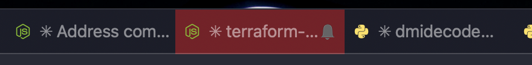

# Colour your iTerm2 tabs when Claude Code is waiting for you

Make iTerm 2 tabs show red/yellow if their Claude Code session is blocked.



I had more Claude Code sessions open than I could keep track of, and every tab looked the same whether it was busy or blocked since breakfast. So I made this.

Written up in more detail here: [My iTerm2 tabs turn red when Claude Code is waiting for me.](https://pocketarc.com/articles/my-iterm2-tabs-turn-red-when-claude-code-is-waiting-for-me)

## What works

Works:

- iTerm2 on macOS
- tmux in iTerm2's control mode (`tmux -CC`)

Does not work:

- Plain tmux.
- Other terminals. They use different escape sequences.
- Linux.

Only Claude Code is supported today. The hooks are three small shell scripts, so adding another agent that can run a command on an event is a small job. Open an issue if you're wanting it.

## Requirements

You need macOS and iTerm2. The colour comes from an iTerm2 escape sequence.

If running Claude in tmux, use iTerm2's control mode (`tmux -CC`).

## Install

Run the installer:

```sh
sh iterm2/install.sh
```

The installer copies the three scripts to `~/.claude/hooks/`. It also writes the launchd agent, fills in your paths, and loads the agent.

Next, merge the `hooks` block from `iterm2/settings-hooks.json` into `~/.claude/settings.json`. Then restart Claude Code.

## Uninstall

```sh
launchctl bootout "gui/$(id -u)/com.pocketarc.claude-tab-fade"
rm ~/Library/LaunchAgents/com.pocketarc.claude-tab-fade.plist
rm -rf ~/.claude/hooks/iterm-tab-*.sh ~/.claude/run/tab-color
```

Also remove the `hooks` block from `~/.claude/settings.json`.

## Status line

This repo also has `statusline/statusline.sh`, the status line I use in Claude Code. It shows the model, the current directory, the git branch, and how much of your usage limit you have spent.

The 5-hour figure is always there: grey below 50%, amber from 50%, red from 80%. The weekly figure only appears from 75% up, because below that it is the 5-hour window that runs out first.

Both figures come from the `rate_limits` field Claude Code passes to the status line. Subscribers only get that field after the first response of a session, so the figures are missing for a moment at the start.

To use it, copy the script to `~/.claude/statusline.sh` and add this to `~/.claude/settings.json`:

```json
{
  "statusLine": {
    "type": "command",
    "command": "~/.claude/statusline.sh"
  }
}
```

## Contributing

Support for another terminal or another agent is very welcome. Each terminal has its own escape sequence, so add a directory for it next to `iterm2/`.

Issues and pull requests are both fine. If something does not work on your setup, say so.

## Questions

If you have any questions, comments or feedback, [open an issue](https://github.com/pocketarc/agent-tab-colors/issues).

## License

MIT. See [LICENSE](LICENSE).
